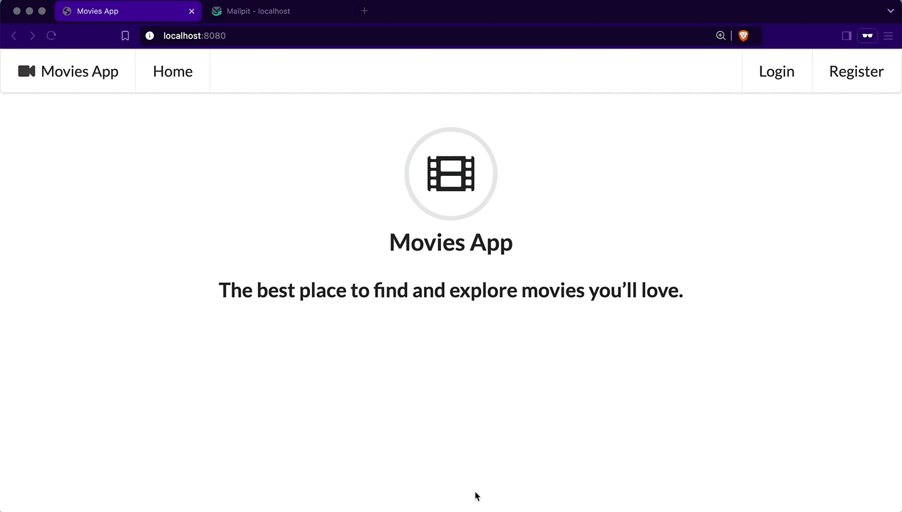

# spring-boot-one-time-token-userpass-auth

The goal of this project is to create a [`Spring Boot`](https://docs.spring.io/spring-boot/index.html) application called `movies-app` that allows users to log in using [`Username/Password Authentication`](https://docs.spring.io/spring-security/reference/servlet/authentication/passwords/index.html) and [`One-Time Token Login`](https://docs.spring.io/spring-security/reference/servlet/authentication/onetimetoken.html).

## Proof-of-Concepts & Articles

On [ivangfr.github.io](https://ivangfr.github.io), I have compiled my Proof-of-Concepts (PoCs) and articles. You can easily search for the technology you are interested in by using the filter. Who knows, perhaps I have already implemented a PoC or written an article about what you are looking for.

## Applications

- ### movies-app

  A `Spring Boot` Java web application that provides a user interface for accessing movie information. To view the movie list, users must first register by providing a username, password, and email. Once registered, they can log in either with their username and password or by requesting a one-time token sent to their email.

  To simulate emails being sent, we are using [`MailPit`](https://mailpit.axllent.org/), a lightweight email testing tool that captures and displays emails from your application in a web interface. It helps developers test email functionality without sending real emails.

## Prerequisites

- [`Java 21+`](https://www.oracle.com/java/technologies/downloads/#java21)
- Some containerization tool [`Docker`](https://www.docker.com), [`Podman`](https://podman.io), etc.

## Start Environment

- In a terminal, make sure you are inside `spring-boot-one-time-token-userpass-auth` root folder;
- Run the following command to start docker compose containers:
  ```
  docker compose up -d
  ```

## Running movies-app using Maven

- In a terminal, make sure you are in `spring-boot-one-time-token-userpass-auth/movies-app` folder;
- Run the following `Maven` command to start the application:
  ```
  ./mvnw clean spring-boot:run --projects movies-app
  ```

## Application URLs

| Application  | URL                   |
|--------------|-----------------------|
| `movies-app` | http://localhost:8080 |
| `MailPit`    | http://localhost:8025 |

## Demonstration

- ### User Registration

  

- ### Username/Password Login

  

- ### One-Time Token Login

  

## Util Commands

- **Postgres**
  ```
  docker exec -it postgres psql -U postgres -d userdb
  \dt
  select * from users;
  ```

## Shutdown

- To stop `movies-app`, go to the terminal where it's running and press `Ctrl+C`;
- To stop and remove docker compose containers, network and volumes, go to a terminal and, inside `spring-boot-one-time-token-userpass-auth` root folder, run the command below:
  ```
  docker compose down -v
  ```
